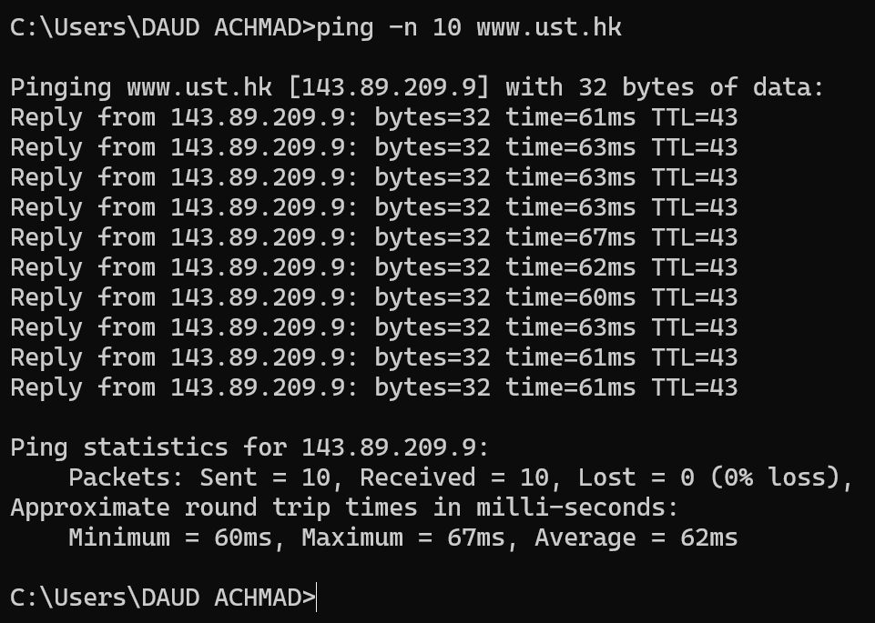
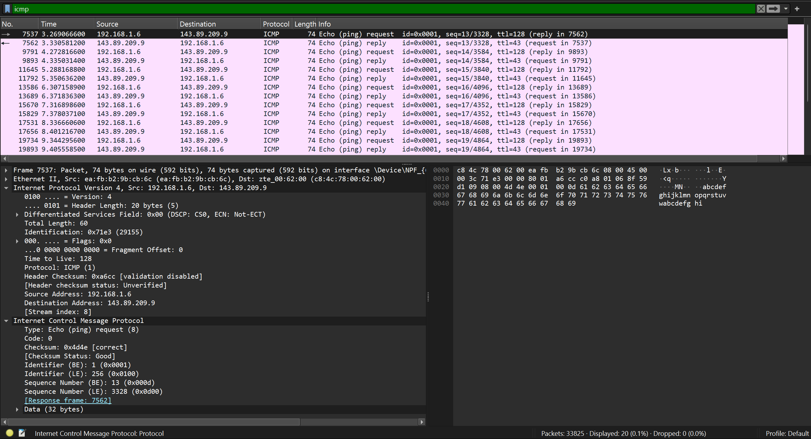
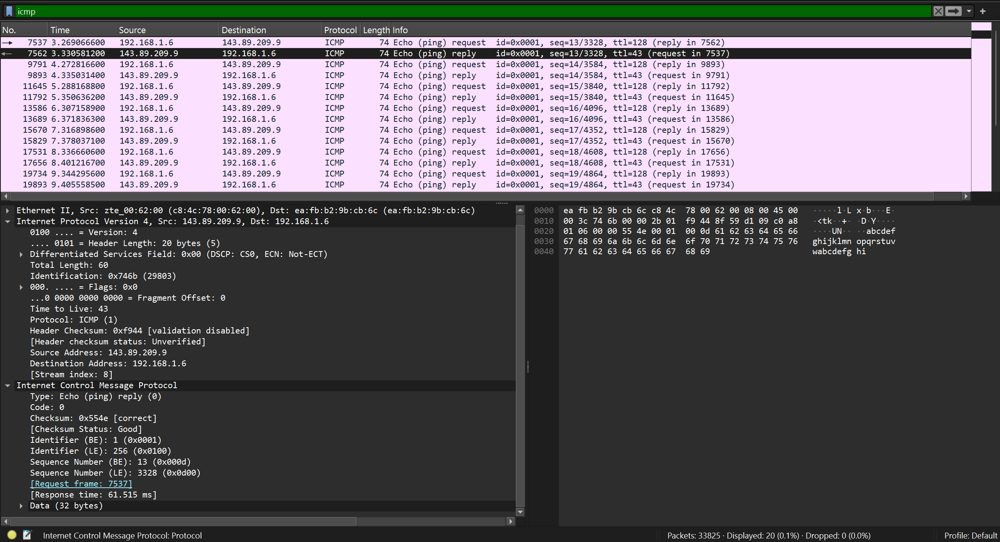
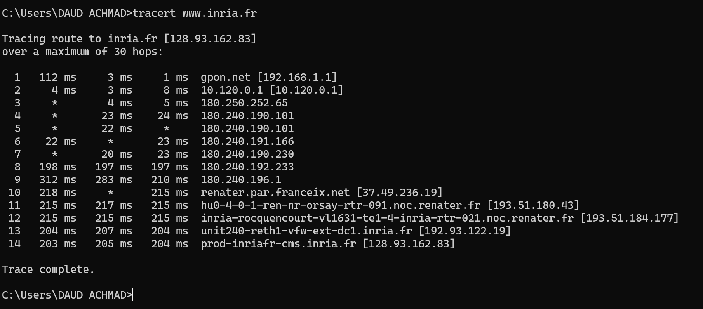
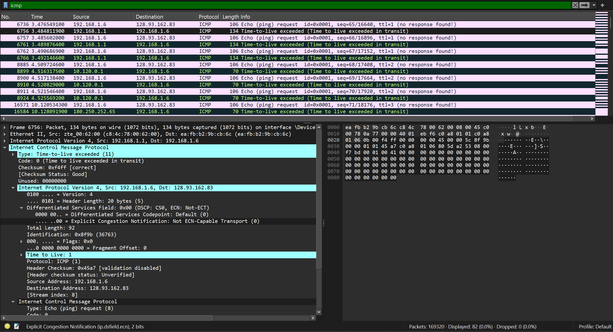

README PRAKTIKUM WIRESHARK ICMP

Nama Praktikum:
Analisis Protokol ICMP Menggunakan Wireshark

Tujuan:
1. Memahami cara kerja protokol ICMP.
2. Menganalisis paket ICMP pada perintah Ping.
3. Menganalisis paket ICMP pada perintah Traceroute.
4. Menggunakan Wireshark untuk menangkap dan membaca paket jaringan.

Tools:
1. Wireshark
2. Command Prompt Windows
3. Koneksi Internet

=================================================================

LANGKAH PRAKTIKUM PING

1. Jalankan aplikasi Wireshark.
2. Pilih interface jaringan yang aktif.
3. Klik Start Capture.
4. Buka Command Prompt.
5. Jalankan perintah berikut:

ping -n 10 www.ust.hk

6. Tunggu proses selesai.
7. Stop capture pada Wireshark.
8. Gunakan filter:

icmp

=================================================================

SCREENSHOT YANG DIBUTUHKAN

1. Hasil Perintah Ping Command Prompt

Penjelasan:
Screenshot menunjukkan hasil eksekusi perintah `ping -n 10 www.ust.hk` yang menampilkan detail statistik ping ke server www.ust.hk dengan IP address 143.89.209.9. Hasil menunjukkan:
- Paket yang dikirim: 10 paket dengan ukuran 32 bytes per paket
- Paket yang diterima: 10 paket (0% packet loss)
- Waktu respons (RTT): Minimum 60ms, Maksimum 67ms, Rata-rata 62ms
- Setiap reply menunjukkan byte size, response time, dan TTL value (43)

Statistik ini membuktikan bahwa host tujuan aktif dan merespons dengan baik.

-------------------------------------------------------------

2. Detail Paket ICMP Echo Request di Wireshark

Penjelasan:
Screenshot menampilkan detail paket ICMP Echo Request (ping request) yang ditangkap Wireshark. Informasi penting yang terlihat:
- Type: Echo (ping) request = 8
- Code: 0
- Source Address: 192.168.1.6
- Destination Address: 143.89.209.9
- Identifier (BE): 1 (0x0001)
- Sequence Number: 13 (0x000d)
- Total paket: 74 bytes

Paket ini adalah permintaan dari host lokal untuk mengecek ketersediaan host tujuan. TTL (Time to Live) diatur pada 128 untuk memungkinkan paket melalui berbagai hop router.

-------------------------------------------------------------

3. Detail Paket ICMP Echo Reply di Wireshark

Penjelasan:
Screenshot menunjukkan detail paket ICMP Echo Reply (ping response) yang diterima dari host tujuan. Informasi penting yang terlihat:
- Type: Echo (ping) reply = 0
- Code: 0
- Source Address: 143.89.209.9 (dari host yang di-ping)
- Destination Address: 192.168.1.6 (kembali ke host pengirim)
- Identifier (BE): 1 (0x0001) - sama dengan request
- Sequence Number: 13 (0x000d) - sama dengan request
- Response Time: 61.515 ms
- Total paket: 74 bytes

Paket balasan ini memiliki struktur identik dengan echo request, namun dengan Type = 0 untuk menandakan bahwa ini adalah reply. Sequence number yang sama memastikan paket request dan reply dapat dicocokkan.

=================================================================

LANGKAH PRAKTIKUM TRACEROUTE

1. Jalankan Wireshark kembali.
2. Mulai capture paket.
3. Jalankan Command Prompt.
4. Jalankan perintah berikut:

tracert www.inria.fr

5. Tunggu proses selesai.
6. Stop capture pada Wireshark.
7. Gunakan filter:

icmp

=================================================================

SCREENSHOT TRACEROUTE

5. Hasil Perintah Tracert di Command Prompt

Penjelasan:
Screenshot menunjukkan hasil eksekusi perintah `tracert www.inria.fr` yang menampilkan rute lengkap dari host lokal ke server inria.fr dengan IP address 128.93.162.83. Hasil meliputi:
- Total 14 hop yang dilalui paket untuk sampai ke tujuan
- Setiap baris menampilkan:
  - Nomor hop
  - 3 nilai RTT (round trip time) dalam milidetik untuk setiap probe
  - Nama host atau IP address dari router/hop tersebut
  
Hop pertama (1) menunjukkan gateway lokal (gpon.net dengan IP 192.168.1.1) dengan RTT 112 ms, 3 ms, 1 ms. Beberapa hop menampilkan * yang berarti timeout (router tidak merespons). Hop terakhir (14) adalah server tujuan prod-inriafr-cms.inria.fr dengan IP 128.93.162.83 dan RTT konsisten di sekitar 200ms.

-------------------------------------------------------------

6. Detail Paket ICMP Time-to-Live Exceeded di Wireshark

Penjelasan:
Screenshot menampilkan paket ICMP Time-to-live exceeded yang dikirim oleh router intermediate selama proses traceroute. Informasi penting yang terlihat:
- Type: Time-to-live exceeded = 11
- Code: 0 (Time to live exceeded in transit)
- Source Address: 192.168.1.1 (dari router yang mengirim pesan)
- Destination Address: 192.168.1.6 (kembali ke host pengirim)
- Message menunjukkan bahwa TTL mencapai 0 sehingga paket didrop
- Time to Live field menunjukkan nilai 1 pada saat paket diterima router

Mekanisme ini adalah inti dari cara kerja traceroute. Traceroute mengirim paket dengan TTL yang semakin bertambah (1, 2, 3, ...) untuk menciptakan Time-Exceeded replies dari setiap hop di jalur ke tujuan. Dengan menganalisis source IP dari replies ini, traceroute dapat menentukan rute lengkap menuju host tujuan.

=================================================================

KESIMPULAN

1. ICMP digunakan untuk komunikasi kontrol dan diagnosis jaringan.
2. Ping menggunakan ICMP Echo Request dan Echo Reply.
3. Traceroute menggunakan mekanisme TTL untuk menemukan jalur paket.
4. Wireshark dapat digunakan untuk menganalisis paket ICMP secara detail.