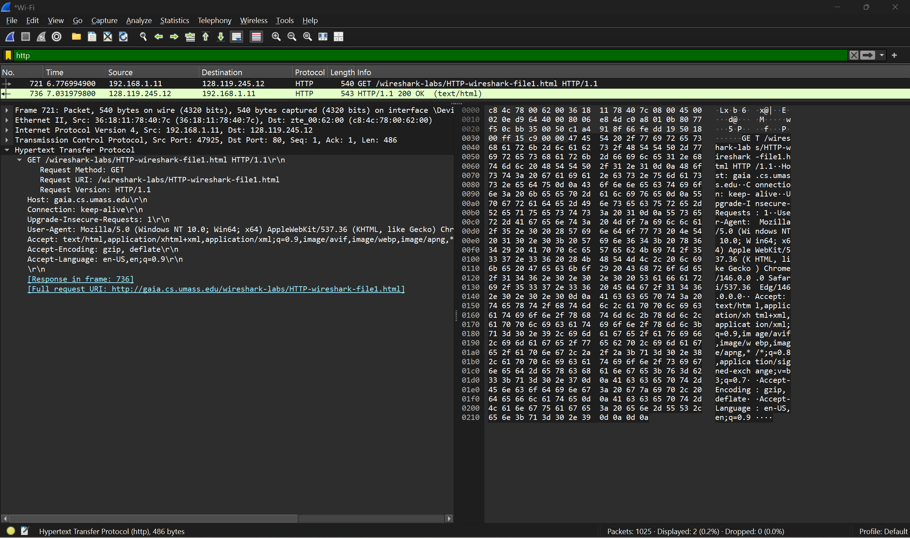
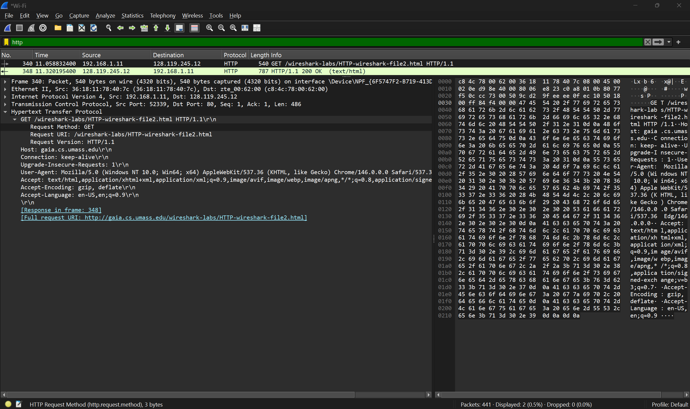
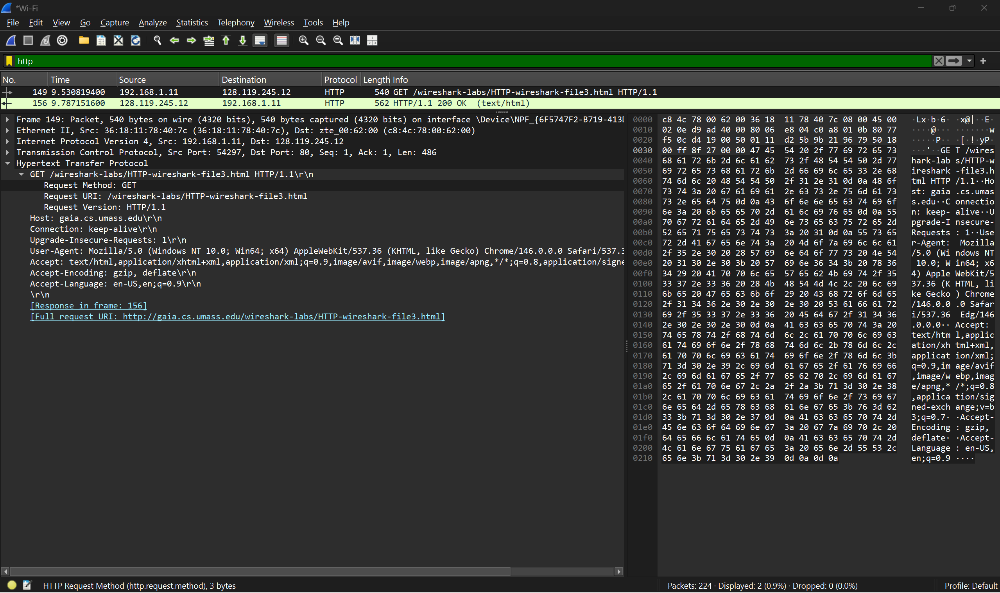
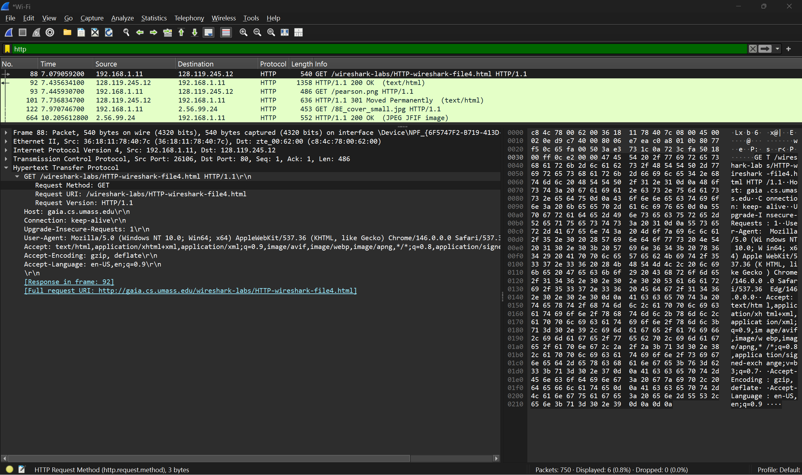
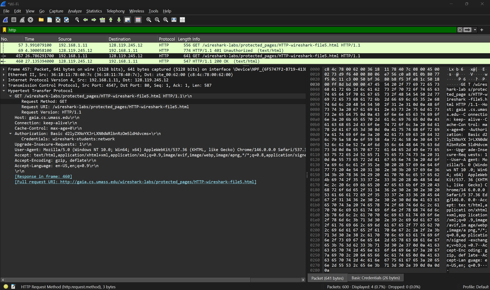

# HTTP Analysis Using Wireshark

Praktikum ini menganalisis komunikasi HTTP menggunakan Wireshark. Analisis dilakukan pada lima skenario berbeda untuk memahami cara kerja request, response, caching, pengiriman file besar, embedded object, dan autentikasi HTTP.

## Tools

- Wireshark
- Web Browser
- Website Wireshark Labs

## Tujuan Praktikum

- Memahami komunikasi HTTP antara client dan server
- Mengamati HTTP Request dan HTTP Response
- Menganalisis caching menggunakan Conditional GET
- Mengamati pengambilan objek pada halaman web
- Menganalisis autentikasi HTTP

---

# 1 Basic HTTP GET Response

URL  
http://gaia.cs.umass.edu/wireshark-labs/HTTP-wireshark-file1.html

Screenshot  

Analisis

Client dengan IP 192.168.1.11 mengirim request ke server 128.119.245.12.

Request yang terlihat pada Wireshark:

GET /wireshark-labs/HTTP-wireshark-file1.html HTTP/1.1

Header penting

Host: gaia.cs.umass.edu  
Connection: keep-alive  
User-Agent: Mozilla Browser

Server memberikan response:

HTTP/1.1 200 OK

Status code 200 menunjukkan server berhasil memproses request dan mengirim file HTML.

Kesimpulan

Browser mengirim HTTP GET request untuk mengambil halaman HTML dan server merespons dengan status 200 OK.

---

# 2 HTTP Conditional GET

URL  
http://gaia.cs.umass.edu/wireshark-labs/HTTP-wireshark-file2.html

Screenshot  

Analisis

Browser mengirim request:

GET /wireshark-labs/HTTP-wireshark-file2.html HTTP/1.1

Server merespons:

HTTP/1.1 200 OK

Conditional GET digunakan ketika browser menyimpan file di cache. Browser dapat mengirim header:

If-Modified-Since

Jika file tidak berubah server akan mengirim response:

304 Not Modified

Hal ini menghemat bandwidth karena file tidak perlu diunduh ulang.

Kesimpulan

Conditional GET memungkinkan browser memanfaatkan cache sehingga transfer data lebih efisien.

---

# 3 Retrieving Long Documents

URL  
http://gaia.cs.umass.edu/wireshark-labs/HTTP-wireshark-file3.html

Screenshot  

Analisis

Client mengirim request:

GET /wireshark-labs/HTTP-wireshark-file3.html HTTP/1.1

Server memberikan response:

HTTP/1.1 200 OK

Karena ukuran file cukup besar, response HTTP dibagi menjadi beberapa paket TCP.

Wireshark menunjukkan proses TCP segmentation untuk mengirim file secara bertahap.

Kesimpulan

File HTML berukuran besar tidak dikirim dalam satu paket tetapi dipecah menjadi beberapa segmen TCP.

---

# 4 HTML with Embedded Objects

URL  
http://gaia.cs.umass.edu/wireshark-labs/HTTP-wireshark-file4.html

Screenshot  

Analisis

Browser pertama mengambil file HTML utama:

GET /wireshark-labs/HTTP-wireshark-file4.html

Server merespons:

HTTP/1.1 200 OK

Setelah itu browser menemukan referensi gambar di dalam HTML.

Browser kemudian mengirim request tambahan seperti:

GET /pearson.png  
GET /8E_cover_small.jpg

Setiap objek pada halaman memerlukan HTTP request terpisah.

Kesimpulan

Halaman web dapat menghasilkan banyak HTTP request karena setiap objek harus diambil secara terpisah.

---

# 5 HTTP Authentication

URL  
http://gaia.cs.umass.edu/wireshark-labs/protected_pages/HTTP-wireshark-file5.html

Screenshot  

Analisis

Client pertama mengirim request ke server.

Server merespons:

HTTP/1.1 401 Unauthorized

Artinya halaman membutuhkan autentikasi.

Setelah user memasukkan username dan password, browser mengirim request baru dengan header:

Authorization: Basic

Wireshark menunjukkan kredensial:

wireshark-students:network

Data tersebut dikodekan menggunakan Base64.

Encoding Base64 hanya mengubah format data dan bukan metode enkripsi.

Kesimpulan

HTTP Basic Authentication tidak aman jika digunakan tanpa HTTPS karena kredensial dapat terlihat pada packet capture.

---

# Kesimpulan Praktikum

- HTTP menggunakan model komunikasi request dan response
- Browser menggunakan metode GET untuk mengambil halaman web
- File besar dikirim melalui beberapa segmen TCP
- Halaman dengan banyak objek menghasilkan banyak HTTP request
- Basic Authentication tidak aman tanpa HTTPS