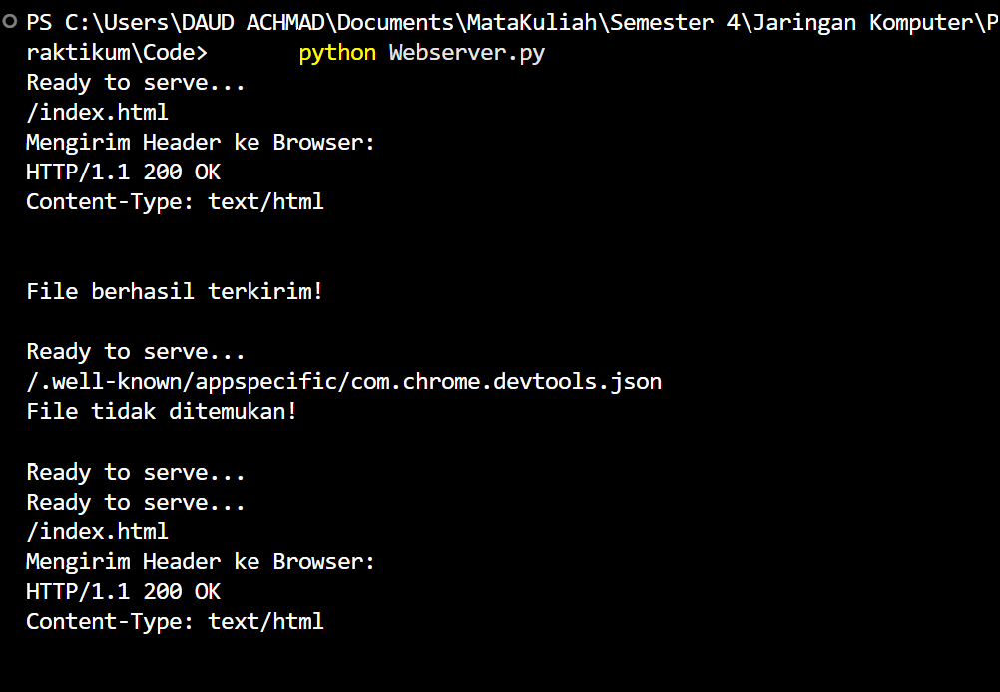

## Penjelasan Kode Server HTTP Sederhana (Python)


- [`index.html`](../assets/week7/index.html)
- [`Webserver.py`](../assets/week7/Webserver.py)

### 1. Import Library

```python
from socket import *
import sys
```

* `socket`: untuk komunikasi jaringan.
* `sys`: untuk menghentikan program.

---

### 2. Membuat Socket Server

```python
serverSocket = socket(AF_INET, SOCK_STREAM)
```

* `AF_INET`: gunakan IPv4.
* `SOCK_STREAM`: gunakan TCP.

---

### 3. Konfigurasi Server

```python
serverPort = 6790
serverSocket.bind(('', serverPort))
serverSocket.listen(1)
```

* Port: 6790.
* `bind('', port)`: menerima koneksi dari semua IP.
* `listen(1)`: maksimal 1 antrian koneksi.

---

### 4. Loop Utama Server

```python
while True:
```

* Server jalan terus, siap menerima request.

---

### 5. Menerima Koneksi

```python
connectionSocket, addr = serverSocket.accept()
```

* `accept()`:

  * `connectionSocket`: socket khusus client.
  * `addr`: alamat client.

---

### 6. Menerima Request HTTP

```python
message = connectionSocket.recv(1024).decode()
```

* Menerima data dari browser.
* Biasanya berisi:

  ```
  GET /index.html HTTP/1.1
  ```

---

### 7. Ambil Nama File

```python
filename = message.split()[1]
f = open(filename[1:], encoding="utf-8")
```

* `split()[1]`: ambil path file, contoh `/index.html`.
* `filename[1:]`: hilangkan `/` → `index.html`.
* Buka file HTML.

---

### 8. Baca Isi File

```python
outputdata = f.read()
```

* Simpan seluruh isi file.

---

### 9. Kirim Header HTTP

```python
header = "HTTP/1.1 200 OK\r\nContent-Type: text/html\r\n\r\n"
connectionSocket.send(header.encode())
```

* Status: 200 OK.
* Content-Type: HTML.
* `\r\n\r\n`: pemisah header dan body.

---

### 10. Kirim Isi File

```python
for i in range(0, len(outputdata)):
    connectionSocket.send(outputdata[i].encode())
```

* Kirim per karakter.
* Kurang efisien, tapi sederhana.

---

### 11. Tutup Koneksi

```python
connectionSocket.close()
```

* Tutup koneksi setelah selesai.

---

### 12. Error Handling (File Tidak Ada)

```python
except IOError:
```

Jika file tidak ditemukan:

```python
connectionSocket.send("HTTP/1.1 404 Not Found\r\n\r\n".encode())
connectionSocket.send("<html><body><h1>404 Not Found</h1></body></html>\r\n".encode())
```

* Kirim status 404.
* Kirim halaman error sederhana.

---

### 13. Menutup Server

```python
serverSocket.close()
sys.exit()
```

* Menutup socket server.
* Menghentikan program.

---

## Ringkasan Alur

1. Server listen di port 6790
2. Client request file via browser
3. Server baca request
4. Ambil nama file
5. Jika ada:

   * kirim header 200
   * kirim isi file
6. Jika tidak ada:

   * kirim 404

---

## Catatan Praktis

* Lebih efisien kirim data langsung:

  ```python
  connectionSocket.send(outputdata.encode())
  ```
* Tambahkan `try-except` untuk keamanan.
* Gunakan multithreading jika ingin banyak client.

**Output**  
