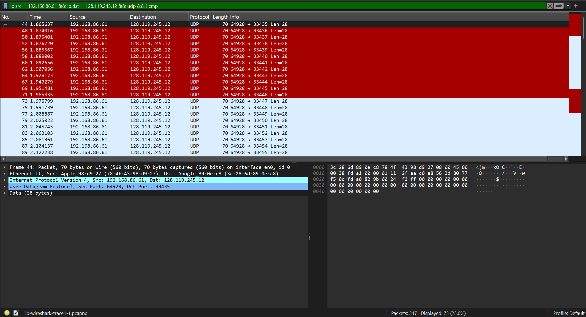
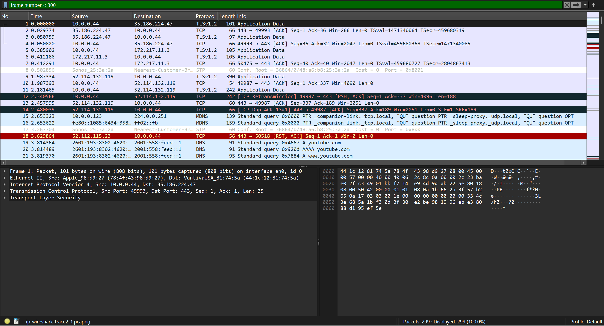

# Laporan Praktikum Jaringan Komputer
## Modul 10 – Analisis Datagram IPv4, Fragmentasi, dan IPv6 dengan Wireshark

---

## 10.1 Pendahuluan
Modul ini bertujuan untuk memahami:
- Mekanisme traceroute dengan IPv4.
- Proses fragmentasi IP pada datagram besar.
- Sekilas analisis IPv6 dan DNS AAAA request.

---

## 10.2 Bagian 1 – IPv4 Dasar
**Tujuan:**  
Mengamati cara traceroute bekerja dengan TTL dan pesan ICMP TTL-exceeded.

**Langkah:**  
1. Jalankan traceroute ke `gaia.cs.umass.edu` dengan ukuran 56 byte.  
2. Gunakan filter Wireshark:  
   - `udp || icmp`  
   - `ip.src==192.168.86.61 && ip.dst==128.119.245.12 && udp && !icmp`  
   - `ip.dst==192.168.86.61 && icmp`  

**Hasil:**  
- Paket UDP dikirim ke tujuan.  
- Router perantara mengembalikan ICMP TTL-exceeded.  

**Screenshot:**  
- **Part 1:** 
- **Part 2:** 
- **Part 3:** 

**Kesimpulan:**  
Traceroute memanfaatkan TTL dan ICMP untuk memetakan jalur hop ke tujuan.

---

## 10.2 Bagian 2 – Fragmentasi
**Tujuan:**  
Menganalisis fragmentasi IP pada datagram UDP besar (±3000 byte).

**Langkah:**  
1. Jalankan traceroute dengan ukuran 3000 byte.  
2. Hilangkan filter, urutkan paket berdasarkan kolom *Time*.  
3. Amati paket UDP besar (Len ≈ 2972).  
4. Perhatikan fragmen IPv4 dengan Identification sama, Offset berbeda, dan MF flag.

**Hasil:**  
- Paket UDP besar (2972 byte) terfragmentasi.  
- Fragmen pertama: Offset = 0, MF = 1.  
- Fragmen kedua: Offset = 1480, MF = 0.  
- Semua fragmen punya Identification sama.  

**Screenshot:**  
- **UDP 3000:** 

**Kesimpulan:**  
Datagram UDP besar tidak dapat dikirim sekaligus sehingga IP memecahnya menjadi beberapa fragmen. Fragmen dikenali lewat Identification, Offset, dan MF flag.

---

## 10.3 Bagian 3 – IPv6
**Tujuan:**  
Melihat sekilas datagram IPv6 dan DNS AAAA request.

**Langkah:**  
1. Buka file `ip-wireshark-trace2-1.pcapng`.  
2. Gunakan filter: `frame.number < 300`.  
3. Amati paket ke-20 (t=3.814489).  

**Hasil:**  
- Paket ke-20 adalah DNS AAAA request untuk `youtube.com`.  
- Header IPv6 menampilkan Traffic Class, Flow Label, Payload Length, Next Header, Hop Limit.  
- Alamat sumber dan tujuan berupa IPv6.  

**Screenshot:**  
- **IPv6:** 

**Kesimpulan:**  
IPv6 menggunakan DNS AAAA untuk resolusi nama ke alamat IPv6. Struktur header lebih sederhana dibanding IPv4.

---

## 10.4 Penutup
Melalui praktikum ini dipahami bahwa:
- Traceroute memanfaatkan TTL dan ICMP untuk memetakan jalur.  
- Datagram besar dipecah oleh IP menjadi fragmen.  
- IPv6 memiliki mekanisme resolusi nama dengan DNS AAAA dan header lebih sederhana.  

