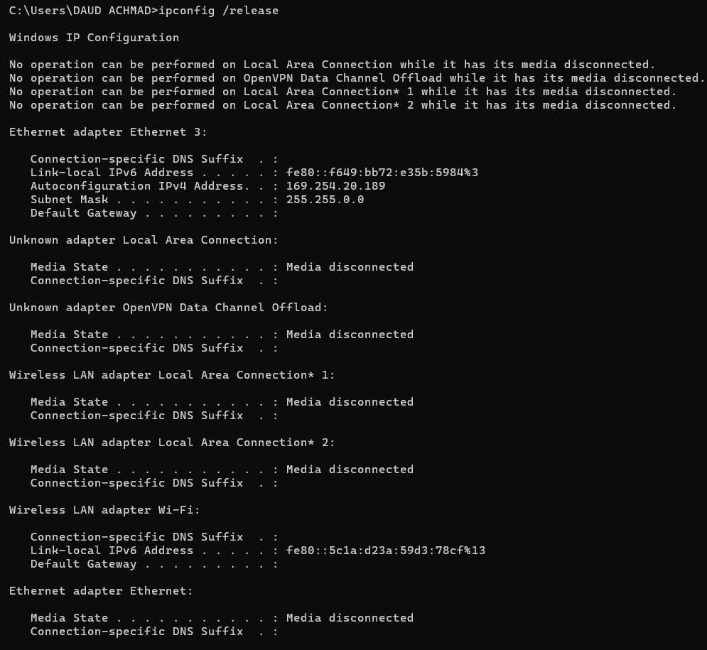
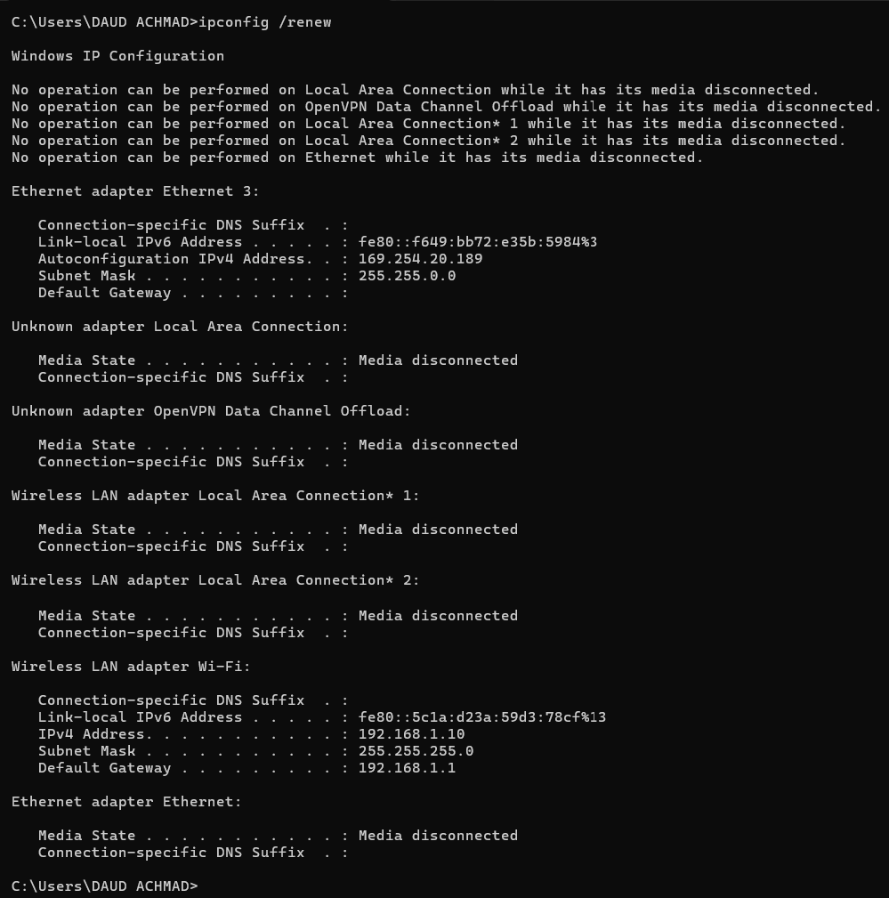
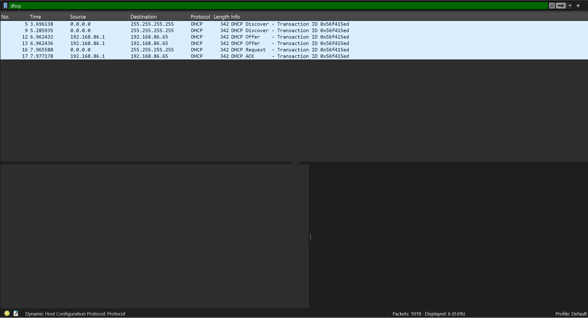
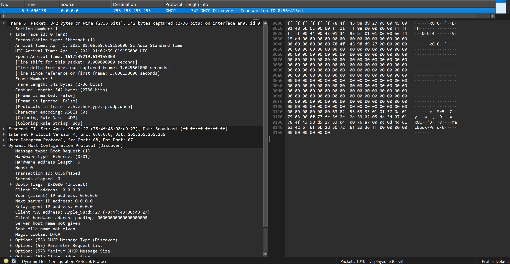
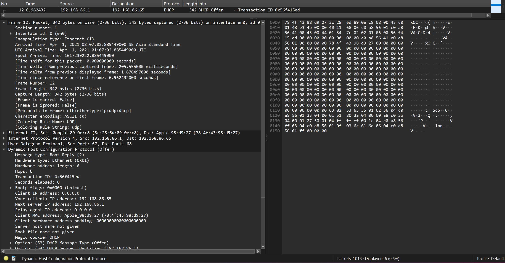
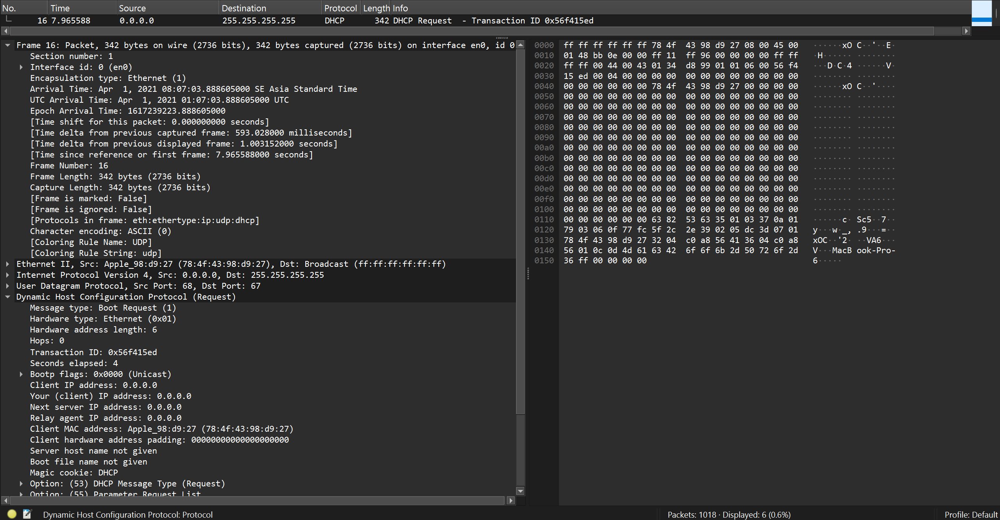
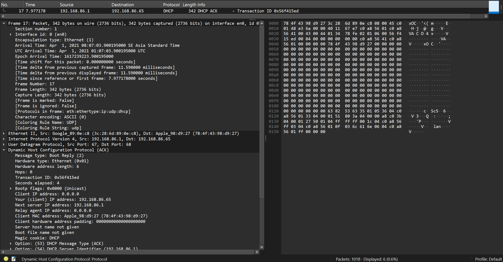

# Modul 11 DHCP

## Tujuan Praktikum
Mahasiswa dapat menginvestigasi cara kerja protokol DHCP menggunakan Wireshark.

---

# Hasil Praktikum DHCP Menggunakan Wireshark

Praktikum ini dilakukan menggunakan file trace DHCP dengan format `.pcapng` pada aplikasi Wireshark. Analisis dilakukan terhadap proses komunikasi DHCP yang terdiri dari DHCP Discover, DHCP Offer, DHCP Request, dan DHCP ACK.

---

# Screenshot dan Penjelasan

## 1. Release IP Address



Perintah yang digunakan:

```cmd
ipconfig /release
```

Penjelasan:

Perintah `ipconfig /release` digunakan untuk melepaskan alamat IP yang sedang digunakan oleh komputer. Setelah perintah dijalankan, komputer tidak lagi memiliki alamat IP dari DHCP server.

---

## 2. Renew IP Address



Perintah yang digunakan:

```cmd
ipconfig /renew
```

Penjelasan:

Perintah `ipconfig /renew` digunakan untuk meminta alamat IP baru kepada DHCP server. Setelah proses berhasil, komputer akan memperoleh konfigurasi jaringan secara otomatis.

---

## 3. Filter Paket DHCP pada Wireshark



Filter yang digunakan:

```wireshark
dhcp
```

Penjelasan:

Filter `dhcp` digunakan untuk menampilkan hanya paket DHCP pada Wireshark sehingga proses komunikasi DHCP lebih mudah dianalisis.

Paket yang muncul:

* DHCP Discover
* DHCP Offer
* DHCP Request
* DHCP ACK

---

## 4. DHCP Discover



Penjelasan:

DHCP Discover merupakan paket pertama yang dikirim oleh client untuk mencari DHCP server yang tersedia pada jaringan.

Fungsi:

* Mencari DHCP server
* Memulai proses permintaan alamat IP

---

## 5. DHCP Offer



Penjelasan:

DHCP Offer merupakan paket balasan dari DHCP server yang berisi penawaran alamat IP kepada client.

Informasi yang diberikan server:

* Alamat IP
* Subnet mask
* Gateway
* Lease time

---

## 6. DHCP Request



Penjelasan:

DHCP Request dikirim oleh client untuk meminta penggunaan alamat IP yang telah ditawarkan oleh DHCP server.

Fungsi:

* Mengonfirmasi pilihan alamat IP
* Memberi tahu server bahwa client menerima penawaran IP

---

## 7. DHCP ACK



Penjelasan:

DHCP ACK merupakan balasan akhir dari DHCP server yang menyatakan bahwa alamat IP telah resmi diberikan kepada client.

Fungsi:

* Mengaktifkan alamat IP pada client
* Menyelesaikan proses DHCP

---

# Urutan Proses DHCP

Proses DHCP terdiri dari empat tahap utama:

1. Discover
   Client mencari DHCP server

2. Offer
   Server menawarkan alamat IP

3. Request
   Client meminta alamat IP yang ditawarkan

4. ACK
   Server menyetujui dan memberikan alamat IP

---

# Kesimpulan

DHCP digunakan untuk memberikan alamat IP secara otomatis kepada client dalam jaringan. Dengan DHCP, konfigurasi jaringan menjadi lebih mudah dan cepat karena tidak perlu mengatur alamat IP secara manual.

Berdasarkan hasil analisis pada Wireshark, proses DHCP berjalan melalui empat tahap yaitu Discover, Offer, Request, dan ACK.
