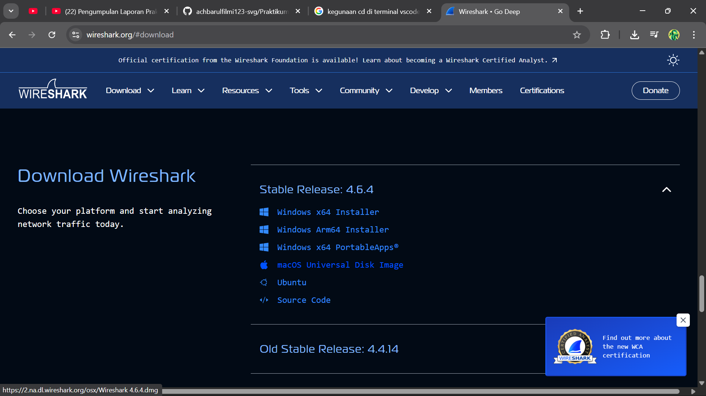
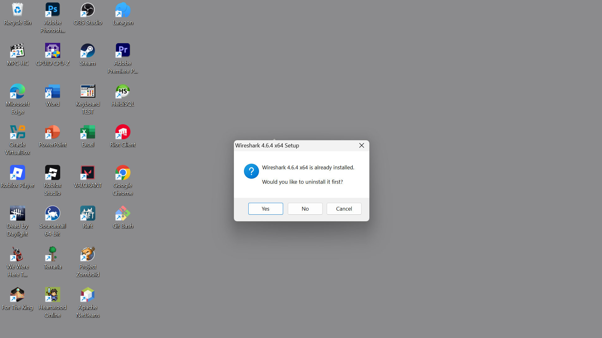
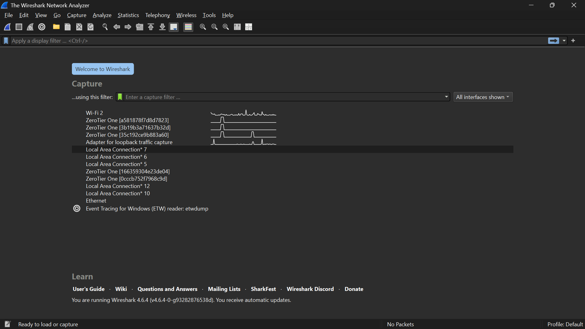
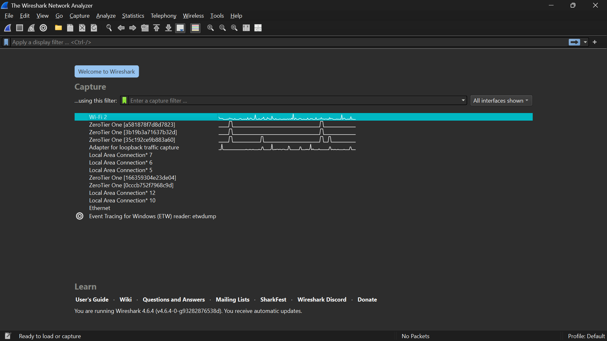
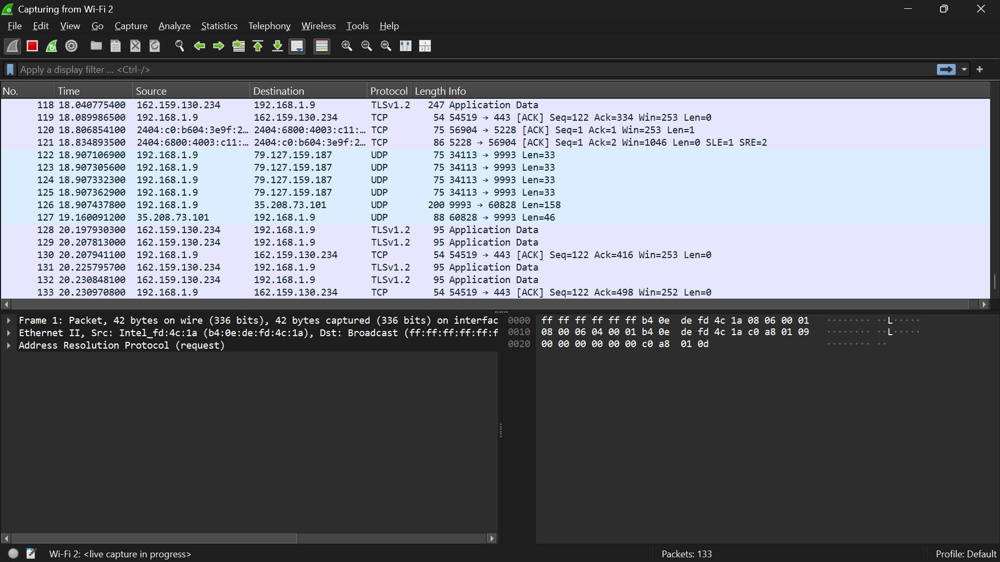
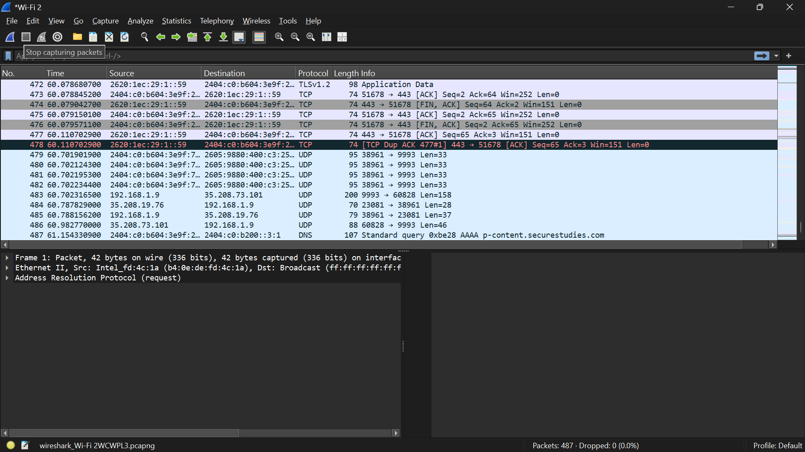

# Laporan week 1 

## Langkah-langkah 
1. instal ISO Wireshark

2. instalasi Wireshark(di sini saya sudah instal)

3. jalankan Wireshark, jika sudah tampilan akan menjadi seperti ini

4. klik wi-fi di kolom capture

5. Wireshark akan otomatis mengambil paket

6. untuk menghentikan pengambilan paket klik stop dengan icon kotak pada tool bar di atas

7. 